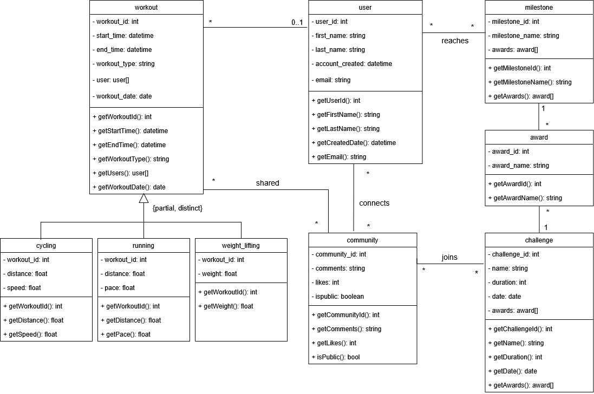

# Fitness App Database

A relational database designed to support a fitness tracking and community platform. Built with MySQL, this project covers the full database design process — from conceptual modeling through implementation, querying, and Python-based data visualization. A partial NoSQL implementation using Neo4j is also included.

## Overview

Many fitness platforms struggle to maintain user engagement over time. This project designs a database to support a platform where users can track workouts, join communities, participate in challenges, reach milestones, and earn awards — with the goal of fostering accountability and motivation.

## Repository Structure

```
fitness-app-database/
│
├── schema.sql           # MySQL DDL — all CREATE TABLE statements
├── db_analysis.py       # Python database connection and visualizations
├── EER_diagram.png      # Entity-Relationship diagram
└── UML_diagram.png      # UML class diagram
```

## Database Design

### Conceptual Model
The EER and UML diagrams define the entities, relationships, and cardinalities for the system.




### Relational Schema
Key tables and relationships:

- **user** — stores user profile information
- **workout** — tracks each workout with start/end time, type, and date; subtypes handled via separate tables (`cycling`, `running`, `weight_lifting`)
- **community** — public or private groups users can connect to
- **challenge** — time-based challenges communities can join
- **milestone** / **award** — tracks user achievements and corresponding rewards
- **connects**, **shared**, **reaches**, **joins** — junction tables managing many-to-many relationships

### Notable Design Decisions
- `CHECK` constraint enforces valid workout types (`cycling`, `running`, `weight_lifting`, `other`)
- `CHECK` constraint enforces `end_time > start_time` on all workouts
- `ON DELETE CASCADE` / `ON UPDATE CASCADE` used throughout to maintain referential integrity
- Workout subtypes implemented as separate tables with a foreign key to `workout`, allowing type-specific attributes (e.g. `pace` for running, `speed` for cycling)

## SQL Queries

Nine analytical queries were written against the database covering:

- Aggregations with GROUP BY and HAVING (total challenges, milestone counts)
- Multi-table JOINs (challenges + communities + awards)
- Subqueries and correlated subqueries (users with no community, milestone completion)
- Set operations with EXCEPT (users not connected to any community)
- Date functions with DATEDIFF (first vs last workout span per user)
- EXISTS for membership checks

## NoSQL Implementation (Neo4j)

Due to the heavy relationship structure between users, milestones, and awards, a partial graph database implementation was completed in Neo4j using Cypher queries to:

- Find users who reached a specific milestone
- Compare milestone completion between two users
- Identify users with multiple cycling workouts

## Python Integration

The database is accessed via Python using `mysql-connector-python`. The `db_analysis.py` file includes:

- Reusable functions for connecting, querying, and closing the database connection
- Bar chart, line chart, and scatter plot visualizations using matplotlib
- Sample queries analyzing challenge trends and workout distances by user

### Setup

```bash
pip install mysql-connector-python matplotlib
```

Set your database credentials as environment variables before running:

```bash
export DB_HOST=localhost
export DB_NAME=your_database_name
export DB_USER=your_username
export DB_PASSWORD=your_password
```

Then run:

```bash
python db_analysis.py
```

## Tech Stack

- **Database:** MySQL, Neo4j
- **Language:** Python
- **Libraries:** mysql-connector-python, matplotlib
- **Design Tools:** draw.io

## Future Work

- Implement MongoDB for unstructured data such as user journals and activity notes
- Expand Neo4j model to support direct user-to-user connections and social graph queries
- Add route tracking to support infrastructure planning based on high-traffic areas
- Build a REST API layer to expose database queries as endpoints
